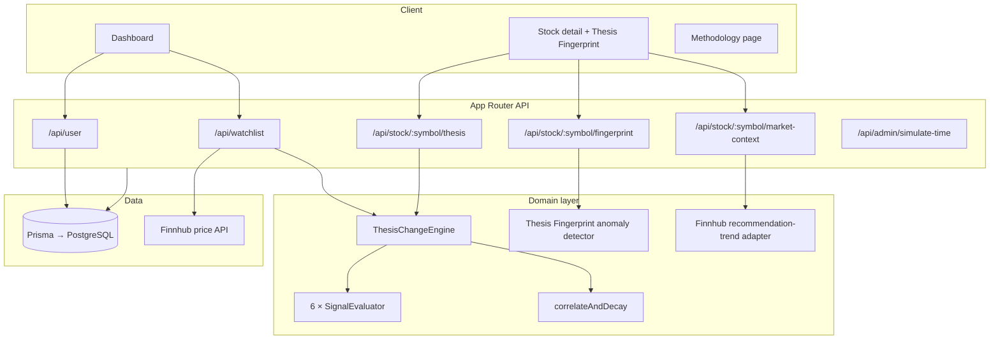

# Undertow

**What's moving beneath the surface — not just the price on top.**

Undertow tracks six independent evidence streams behind each stock (earnings, analyst sentiment, ownership, risk, valuation, and technicals), compares them against your last visit, and surfaces only the shifts that cross a meaningful threshold. Conflicting signals stay visible rather than being averaged into a false consensus. Its experimental **Thesis Fingerprint** also measures whether the current modelled thesis shape is familiar or unusual relative to that stock's available snapshot history.

The database, authentication, watchlist, snapshot persistence, change engine, and UI are fully implemented. Market signals are simulated for the demo; prices can be live (Finnhub) or snapshot-based depending on mode.

---

## Problem & Approach

Most watchlists answer *"what is the price?"* Undertow answers *"what changed in the thesis since I last looked?"*

| Typical watchlist | Undertow |
| --- | --- |
| Price-centric | Evidence-centric |
| All movement treated equally | Threshold-based meaningful change |
| Single blended score | Six independent signal evaluators |
| No visit baseline | `lastVisit`-anchored comparison |

The useful unit is a **dated thesis snapshot** — a structured record of evidence at a point in time. Change events are derived on read by comparing the latest snapshot to the one before your last visit.

---

## Demo Flow

1. **Sign in** with any email (`demo@undertow.local` is pre-seeded).
2. **Review the ledger** — nine demo symbols with four modelled snapshots each. A first visit shows the baseline, not fabricated changes since last time.
3. **Toggle Live / Simulated** — live mode fetches Finnhub prices; simulated mode uses snapshot prices.
4. **Simulate thesis evolution** — creates a synthetic future snapshot with deliberate deltas across all signal fields.
5. **Reload the watchlist** — independent change summaries appear per symbol (NVDA demonstrates earnings/analyst conflict).
6. **Open a stock detail page** — inspect the full signal ledger, conflict callouts, historical timeline, Thesis Shape, and Thesis Unusualness.
7. **Review supplementary context** — when the configured Finnhub plan returns it, a clearly separated analyst recommendation trend appears alongside, never inside, the modelled thesis signal.

---

## Architecture



**Watchlist read path:**

1. Authenticate via HMAC-signed HTTP-only cookie.
2. Load watchlist items and latest `ThesisSnapshot` per symbol (batched, concurrency-capped at 5).
3. Resolve price by mode: Finnhub (live) or snapshot field (simulated).
4. Compare current snapshot to the snapshot before the stored `lastVisit` through the change engine.
5. Return structured JSON validated with Zod. `lastVisit` is written only on a first visit (when it was null) so later refreshes keep the same baseline.

**Fingerprint read path:**

1. Authenticate with the same signed session cookie used by the watchlist.
2. Read up to 25 dated snapshots for the requested symbol; the latest is the current state and the remaining records form the historical profile.
3. Normalize the six modelled dimensions, calculate their historical centroid and dispersion, then measure the current vector's standardized distance.
4. Return a read-only experimental signal, a per-dimension contribution breakdown, and a compact snapshot timeline. This endpoint does not alter the existing thesis response contract or the change engine.

**Market-context read path:**

1. Authenticate with the ordinary signed session cookie.
2. Read Finnhub's current recommendation-trend record through a 30-second in-memory cache.
3. Show its buy/hold/sell counts with source, provider-response period, and fetch time as supplementary real data.
4. Keep this record fully separate from `analystScore`, which remains a modelled thesis input. A missing key, unsupported plan, invalid provider response, or network failure returns an explicitly unavailable context rather than fabricated data.

---

## Engineering Design

### SOLID signal engine

| Principle | Implementation |
| --- | --- |
| **Single responsibility** | Each evaluator owns one signal type (`earnings`, `analyst`, …). |
| **Open/closed** | New signals register in `registry.ts`; orchestration code stays unchanged. |
| **Dependency inversion** | `ThesisChangeEngine` depends on the `SignalEvaluator` interface, not concrete classes. |
| **Interface segregation** | Evaluators know nothing about Prisma, HTTP, or cookies. |

Evaluators are pure functions over `ThesisSnapshot` pairs. The engine composes them via `flatMap` — no branching on signal type in orchestration logic.

### Correlation & decay

`correlateAndDecay` applies time-based severity decay (72-hour half-life) and flags compounding when multiple non-neutral signals move within a 48-hour window. Threshold logic stays in evaluators; temporal scoring stays separate.

### Thesis Fingerprint (experimental ML signal)

Thesis Fingerprint is an isolated, deterministic anomaly detector over Undertow's available snapshot history—not a return prediction or a trained external-market model. It consumes existing snapshots and never changes evaluator, threshold, engine, correlation, or decay behavior.

Each dimension is normalized to a bounded axis before historical profiling. For each axis, the detector calculates a centroid and population standard deviation from prior complete snapshots, using a normalized dispersion floor of `0.10` to avoid divide-by-zero behavior. The current standardized departure is:

`dᵢ = |currentᵢ − centroidᵢ| / max(stddevᵢ, 0.10)`

Overall distance is the RMS of six departures. The displayed unusualness score is `round(100 × (1 − exp(−distance / 2)))`, bounded to 0–100: **Normal** is below 30, **Watch** is 30–59, and **Unusual** is 60 or more. Each dimension's contribution is its share of squared distance. At least two prior complete snapshots are required; otherwise the interface reports that the historical profile is still forming.

### Boundary validation

Zod schemas guard API request and response shapes at route boundaries. Invalid input returns explicit 400 responses; output is parsed before send.

### Auth

Email-only identity: `POST /api/user` get-or-creates a `User`, signs the id with HMAC-SHA256, and sets an HTTP-only cookie. Tampered cookies fail `timingSafeEqual` verification. Re-login with the same email restores the same watchlist.

### Price modes

- **Live** → `fetchLivePrice()` (Finnhub, 30s cache); fallback to snapshot price only on API failure.
- **Simulated** → `ThesisSnapshot.signals.price` only; Finnhub is never called.

Signal comparison and thesis logic are identical in both modes.

### Real supplementary analyst context

`fetchAnalystConsensus()` calls Finnhub's `GET /stock/recommendation` endpoint when `FINNHUB_API_KEY` is configured. Finnhub returns counts for strong buy, buy, hold, sell, and strong sell recommendations by period. Undertow displays these counts only as sourced market context. They are never converted into, persisted as, or used to update the modelled `analystScore` evaluator field.

---

## Signal Model

Each evaluator reads one numeric field from a snapshot. Absolute deltas below **5 units** are ignored. Severity escalates at **10** and **15**.

| Signal | Snapshot key | Threshold | Positive direction |
| --- | --- | --- | --- |
| Earnings | `epsSurprise` | ≥ 5 pp | Larger EPS surprise |
| Analyst | `analystScore` | ≥ 5 pts | Higher score |
| Ownership | `institutionalOwnership` | ≥ 5 pp | More institutional ownership |
| Risk | `riskScore` | ≥ 5 pts | **Lower** risk score |
| Valuation | `peRatio` | ≥ 5× | **Lower** P/E ratio |
| Technical | `technicalScore` | ≥ 5 pts | Higher score |

Severity: `1` (meaningful), `2` (≥ 10), `3` (≥ 15). First visit sets `isFirstVisit: true` rather than fabricating a baseline.

**Simulate-time** advances all seven fields (six signals + price) for every symbol on the watchlist, preserving NVDA's conflicting earnings/analyst pair. The guided demo triggers three synthetic snapshots to make the timeline and Thesis Fingerprint behavior immediately inspectable. Seed data provides four modelled snapshots per demo symbol so the fingerprint has initial history after `npm run db:seed`.

---

## Project Structure

```
undertow/
├── prisma/
│   ├── migrations/
│   │   └── 20260904181659_init/
│   │       └── migration.sql
│   ├── schema.prisma              # User, WatchlistItem, ThesisSnapshot
│   └── seed.ts                    # Nine demo symbols + demo user
│
├── src/
│   ├── app/
│   │   ├── api/
│   │   │   ├── admin/
│   │   │   │   └── simulate-time/route.ts
│   │   │   ├── briefing/
│   │   │   │   └── email/route.ts
│   │   │   ├── stock/[symbol]/
│   │   │   │   ├── fingerprint/route.ts # Read-only Thesis Fingerprint API
│   │   │   │   ├── market-context/route.ts # Sourced Finnhub consensus context
│   │   │   │   └── thesis/route.ts
│   │   │   ├── watchlist/
│   │   │   │   ├── [symbol]/route.ts
│   │   │   │   └── route.ts
│   │   │   ├── db-health/route.ts
│   │   │   ├── health/route.ts
│   │   │   ├── logout/route.ts
│   │   │   └── user/route.ts
│   │   ├── how-it-works/
│   │   │   └── page.tsx
│   │   ├── stock/[symbol]/
│   │   │   └── page.tsx
│   │   ├── globals.css
│   │   ├── layout.tsx
│   │   └── page.tsx               # Dashboard entry
│   │
│   ├── components/
│   │   ├── ChangeBanner.tsx
│   │   ├── Dashboard.tsx
│   │   ├── DemoChips.tsx
│   │   ├── EmptyState.tsx
│   │   ├── PriceModeLabel.tsx
│   │   ├── StaleBadge.tsx
│   │   ├── StockDetail.tsx
│   │   └── ThesisFingerprint.tsx       # Unusualness, contributors, shape, timeline
│   │
│   └── lib/
│       ├── signals/
│       │   ├── evaluators/
│       │   │   ├── analyst.ts
│       │   │   ├── earnings.ts
│       │   │   ├── ownership.ts
│       │   │   ├── risk.ts
│       │   │   ├── technical.ts
│       │   │   └── valuation.ts
│       │   ├── correlate.ts       # Decay & compounding
│       │   ├── engine.ts          # ThesisChangeEngine
│       │   ├── registry.ts        # Evaluator composition
│       │   └── types.ts           # SignalEvaluator interface
│       ├── auth.ts                # HMAC cookie signing
│       ├── analyst-context.ts      # Finnhub recommendation-trend adapter
│       ├── cache.ts               # 30s in-memory TTL
│       ├── email.ts               # Briefing delivery
│       ├── fingerprint.ts          # Isolated deterministic anomaly detector
│       ├── market.ts              # Snapshot helpers, batching
│       ├── price.ts               # Finnhub live price
│       └── prisma.ts              # Database client
│
├── tests/
│   ├── api/
│   │   ├── auth-roundtrip.test.ts
│   │   ├── edge-cases.test.ts
│   │   ├── health.test.ts
│   │   ├── routes.test.ts
│   │   ├── simulate-time-coverage.test.ts
│   │   ├── watchlist-last-visit.test.ts
│   │   └── watchlist-price-mode.test.ts
│   ├── signals/
│   │   ├── analyst.test.ts
│   │   ├── correlate.test.ts
│   │   ├── earnings.test.ts
│   │   ├── engine.test.ts
│   │   ├── evidence-language.test.ts
│   │   ├── ownership.test.ts
│   │   ├── risk.test.ts
│   │   ├── technical.test.ts
│   │   └── valuation.test.ts
│   ├── auth.test.ts
│   ├── analyst-context.test.ts     # Real-context response parsing coverage
│   ├── edge-cases.test.ts
│   ├── fingerprint.test.ts         # Fingerprint anomaly and determinism coverage
│   └── price.test.ts
│
├── .env.example
├── .gitignore
├── next.config.ts
├── package.json
├── prisma.config.ts
├── tsconfig.json
└── vitest.config.mts
```

---

## Run Locally

**Prerequisites:** Node.js 20+, a PostgreSQL database (e.g. [Neon](https://neon.tech))

```bash
git clone <repo-url>
cd undertow
cp .env.example .env
```

Edit `.env` and set at minimum:

| Variable | Required |
| --- | --- |
| `DATABASE_URL` | Yes — Postgres connection string |
| `AUTH_SECRET` or `COOKIE_SECRET` | Yes — any long random string |

Optional: `FINNHUB_API_KEY` (live prices), `SMTP_*` (email briefing).

```bash
npm install
npx prisma migrate deploy
npm run db:seed
npm run dev
```

Open [http://localhost:3000](http://localhost:3000). Sign in with `demo@undertow.local` or any email — the seed creates nine demo symbols on the watchlist.

```bash
npm test        # run test suite
npm run build   # production build check
```
