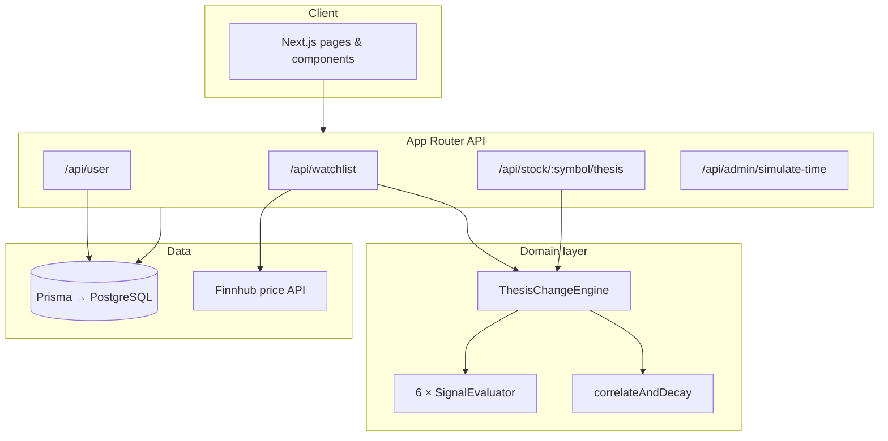

# Undertow

**What's moving beneath the surface — not just the price on top.**

Undertow tracks six independent evidence streams behind each stock (earnings, analyst sentiment, ownership, risk, valuation, and technicals), compares them against your last visit, and surfaces only the shifts that cross a meaningful threshold. Conflicting signals stay visible rather than being averaged into a false consensus.

The database, authentication, watchlist, snapshot persistence, change engine, and UI are fully implemented. Market signals are simulated for the demo; prices can be live (Finnhub) or snapshot-based depending on mode.

---

## Problem & Approach

Most watchlists answer *"what is the price?"* Undertow answers *"what changed in the thesis since I last looked?"*

| Typical watchlist | Undertow |
| --- | --- |
| Price-centric | Evidence-centric |
| All movement treated equally | Threshold-based meaningful change |
| Single blended score | Six independent signal evaluators |
| No visit baseline | `lastVisit`-anchored comparison |

The useful unit is a **dated thesis snapshot** — a structured record of evidence at a point in time. Change events are derived on read by comparing the latest snapshot to the one before your last visit.

---

## Demo Flow

1. **Sign in** with any email (`demo@undertow.local` is pre-seeded).
2. **Review the ledger** — nine demo symbols with modelled current stats. A first visit shows the baseline, not fabricated changes since last time.
3. **Toggle Live / Simulated** — live mode fetches Finnhub prices; simulated mode uses snapshot prices.
4. **Advance time** — creates newer snapshots with deliberate deltas across all signal fields.
5. **Reload the watchlist** — independent change summaries appear per symbol (NVDA demonstrates earnings/analyst conflict).
6. **Open a stock detail page** — full signal ledger, conflict callouts, and snapshot evidence.

---

## Architecture



**Watchlist read path:**

1. Authenticate via HMAC-signed HTTP-only cookie.
2. Load watchlist items and latest `ThesisSnapshot` per symbol (batched, concurrency-capped at 5).
3. Resolve price by mode: Finnhub (live) or snapshot field (simulated).
4. Compare current snapshot to the snapshot before the stored `lastVisit` through the change engine.
5. Return structured JSON validated with Zod. `lastVisit` is written only on a first visit (when it was null) so later refreshes keep the same baseline.

---

## Engineering Design

### SOLID signal engine

| Principle | Implementation |
| --- | --- |
| **Single responsibility** | Each evaluator owns one signal type (`earnings`, `analyst`, …). |
| **Open/closed** | New signals register in `registry.ts`; orchestration code stays unchanged. |
| **Dependency inversion** | `ThesisChangeEngine` depends on the `SignalEvaluator` interface, not concrete classes. |
| **Interface segregation** | Evaluators know nothing about Prisma, HTTP, or cookies. |

Evaluators are pure functions over `ThesisSnapshot` pairs. The engine composes them via `flatMap` — no branching on signal type in orchestration logic.

### Correlation & decay

`correlateAndDecay` applies time-based severity decay (72-hour half-life) and flags compounding when multiple non-neutral signals move within a 48-hour window. Threshold logic stays in evaluators; temporal scoring stays separate.

### Boundary validation

Zod schemas guard API request and response shapes at route boundaries. Invalid input returns explicit 400 responses; output is parsed before send.

### Auth

Email-only identity: `POST /api/user` get-or-creates a `User`, signs the id with HMAC-SHA256, and sets an HTTP-only cookie. Tampered cookies fail `timingSafeEqual` verification. Re-login with the same email restores the same watchlist.

### Price modes

- **Live** → `fetchLivePrice()` (Finnhub, 30s cache); fallback to snapshot price only on API failure.
- **Simulated** → `ThesisSnapshot.signals.price` only; Finnhub is never called.

Signal comparison and thesis logic are identical in both modes.

---

## Signal Model

Each evaluator reads one numeric field from a snapshot. Absolute deltas below **5 units** are ignored. Severity escalates at **10** and **15**.

| Signal | Snapshot key | Threshold | Positive direction |
| --- | --- | --- | --- |
| Earnings | `epsSurprise` | ≥ 5 pp | Larger EPS surprise |
| Analyst | `analystScore` | ≥ 5 pts | Higher score |
| Ownership | `institutionalOwnership` | ≥ 5 pp | More institutional ownership |
| Risk | `riskScore` | ≥ 5 pts | **Lower** risk score |
| Valuation | `peRatio` | ≥ 5× | **Lower** P/E ratio |
| Technical | `technicalScore` | ≥ 5 pts | Higher score |

Severity: `1` (meaningful), `2` (≥ 10), `3` (≥ 15). First visit sets `isFirstVisit: true` rather than fabricating a baseline.

**Simulate-time** advances all seven fields (six signals + price) for every symbol on the watchlist, preserving NVDA's conflicting earnings/analyst pair.

---

## Project Structure

```
undertow/
├── prisma/
│   ├── migrations/
│   │   └── 20260904181659_init/
│   │       └── migration.sql
│   ├── schema.prisma              # User, WatchlistItem, ThesisSnapshot
│   └── seed.ts                    # Nine demo symbols + demo user
│
├── src/
│   ├── app/
│   │   ├── api/
│   │   │   ├── admin/
│   │   │   │   └── simulate-time/route.ts
│   │   │   ├── briefing/
│   │   │   │   └── email/route.ts
│   │   │   ├── stock/[symbol]/
│   │   │   │   └── thesis/route.ts
│   │   │   ├── watchlist/
│   │   │   │   ├── [symbol]/route.ts
│   │   │   │   └── route.ts
│   │   │   ├── db-health/route.ts
│   │   │   ├── health/route.ts
│   │   │   ├── logout/route.ts
│   │   │   └── user/route.ts
│   │   ├── how-it-works/
│   │   │   └── page.tsx
│   │   ├── stock/[symbol]/
│   │   │   └── page.tsx
│   │   ├── globals.css
│   │   ├── layout.tsx
│   │   └── page.tsx               # Dashboard entry
│   │
│   ├── components/
│   │   ├── ChangeBanner.tsx
│   │   ├── Dashboard.tsx
│   │   ├── DemoChips.tsx
│   │   ├── EmptyState.tsx
│   │   ├── PriceModeLabel.tsx
│   │   ├── StaleBadge.tsx
│   │   └── StockDetail.tsx
│   │
│   └── lib/
│       ├── signals/
│       │   ├── evaluators/
│       │   │   ├── analyst.ts
│       │   │   ├── earnings.ts
│       │   │   ├── ownership.ts
│       │   │   ├── risk.ts
│       │   │   ├── technical.ts
│       │   │   └── valuation.ts
│       │   ├── correlate.ts       # Decay & compounding
│       │   ├── engine.ts          # ThesisChangeEngine
│       │   ├── registry.ts        # Evaluator composition
│       │   └── types.ts           # SignalEvaluator interface
│       ├── auth.ts                # HMAC cookie signing
│       ├── cache.ts               # 30s in-memory TTL
│       ├── email.ts               # Briefing delivery
│       ├── market.ts              # Snapshot helpers, batching
│       ├── price.ts               # Finnhub live price
│       └── prisma.ts              # Database client
│
├── tests/
│   ├── api/
│   │   ├── auth-roundtrip.test.ts
│   │   ├── edge-cases.test.ts
│   │   ├── health.test.ts
│   │   ├── routes.test.ts
│   │   ├── simulate-time-coverage.test.ts
│   │   ├── watchlist-last-visit.test.ts
│   │   └── watchlist-price-mode.test.ts
│   ├── signals/
│   │   ├── analyst.test.ts
│   │   ├── correlate.test.ts
│   │   ├── earnings.test.ts
│   │   ├── engine.test.ts
│   │   ├── evidence-language.test.ts
│   │   ├── ownership.test.ts
│   │   ├── risk.test.ts
│   │   ├── technical.test.ts
│   │   └── valuation.test.ts
│   ├── auth.test.ts
│   ├── edge-cases.test.ts
│   └── price.test.ts
│
├── .env.example
├── .gitignore
├── next.config.ts
├── package.json
├── prisma.config.ts
├── tsconfig.json
└── vitest.config.mts
```

---

## Run Locally

**Prerequisites:** Node.js 20+, a PostgreSQL database (e.g. [Neon](https://neon.tech))

```bash
git clone <repo-url>
cd undertow
cp .env.example .env
```

Edit `.env` and set at minimum:

| Variable | Required |
| --- | --- |
| `DATABASE_URL` | Yes — Postgres connection string |
| `AUTH_SECRET` or `COOKIE_SECRET` | Yes — any long random string |

Optional: `FINNHUB_API_KEY` (live prices), `SMTP_*` (email briefing).

```bash
npm install
npx prisma migrate deploy
npm run db:seed
npm run dev
```

Open [http://localhost:3000](http://localhost:3000). Sign in with `demo@undertow.local` or any email — the seed creates nine demo symbols on the watchlist.

```bash
npm test        # run test suite
npm run build   # production build check
```
